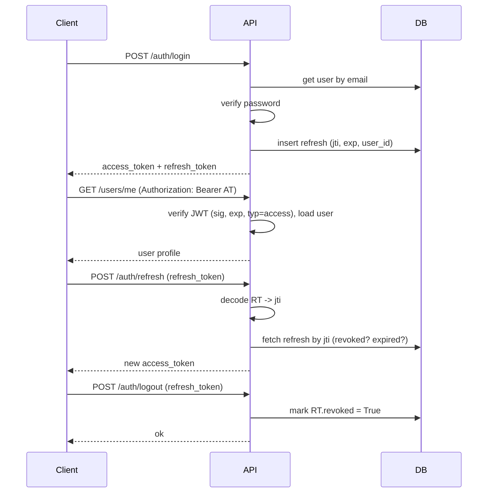

# FastAPI Skeleton — Comprehensive Documentation

> Production-lean starter with **FastAPI**, **SQLite (async SQLAlchemy)**, **JWT auth (access+refresh)**, **role-based authorization**, **token-bucket rate limiting**, and **typed config via `.env`**.

---

## 1) Architecture Overview

### 1.1 High-level
- **API Layer (FastAPI)** — HTTP endpoints, request validation, dependencies.
- **Auth Layer** — Password hashing (Passlib), JWT issue/verify, role checks.
- **Rate Limiter** — Token-bucket, keyed by user-id or client IP.
- **Data Layer (SQLAlchemy async)** — SQLite for dev; models for `users` and `refresh_tokens`.
- **Config Layer** — Central `Settings` via Pydantic Settings + `.env`.

### 1.2 Repository Layout
```
app/
  api/
    routes/
      auth.py     # register, login, refresh, logout
      users.py    # /me, /admin/secret
      public.py   # ping, health
    deps.py       # get_current_user, require_roles
    router.py     # single router with global rate limit dependency
  core/
    config.py     # Settings (env/.env)
    security.py   # hashing, JWT encode/decode
    rate_limit.py # in-memory token bucket
  db/
    session.py    # async engine & session
    models.py     # User, RefreshToken
    init_db.py    # create tables on startup
  schemas/
    auth.py, user.py  # request/response pydantic schemas
  main.py         # FastAPI app, CORS, startup DB init
.env.example
requirements.txt
```

---

## 2) Setup & Run

### 2.1 Windows (with `uv`)
```powershell
uv venv
.venv\Scripts\activate
uv pip install -r requirements.txt
copy .env.example .env
uvicorn app.main:app --reload
# open http://127.0.0.1:8000/docs
```

> If you hit `EmailStr` errors, install: `uv pip install "pydantic[email]"`  
> If you hit `greenlet` errors, install: `uv pip install greenlet`  
> For bcrypt version logs, either `uv pip install "bcrypt<4"` **or** switch to argon2 (`uv pip install argon2-cffi` and set `schemes=["argon2"]`).

### 2.2 Environment Variables (`.env`)
```ini
PROJECT_NAME=FastAPI Skeleton
SECRET_KEY=change-me
ACCESS_TOKEN_EXPIRES_MINUTES=15
REFRESH_TOKEN_EXPIRES_DAYS=7
JWT_ALGORITHM=HS256
DATABASE_URL=sqlite+aiosqlite:///./app.db
RATE_LIMIT_DEFAULT_LIMIT=60
RATE_LIMIT_DEFAULT_WINDOW=60
RATE_LIMIT_LOGIN_LIMIT=5
RATE_LIMIT_LOGIN_WINDOW=60
ENVIRONMENT=dev
```

---

## 3) Database & Models

### 3.1 Models
- **User**
  - `id: int (PK)`
  - `email: str (unique)`
  - `full_name: Optional[str]`
  - `hashed_password: str`
  - `is_active: bool = True`
  - `role: str = "user"`  (e.g., `user`, `admin`)

- **RefreshToken**
  - `id: int (PK)`
  - `user_id: int (FK -> users.id)`
  - `jti: str (unique)`
  - `expires_at: datetime`
  - `revoked: bool`
  - `created_at: datetime`

> Tables are created automatically at startup via `init_db(engine)`.

---

## 4) Auth & Authorization

### 4.1 Flow Summary
1. **Register** → create user with hashed password.  
2. **Login** → validate password → issue **access** + **refresh** tokens.  
3. **Use API** → send `Authorization: Bearer <access_token>` for protected routes.  
4. **Refresh** → exchange valid refresh token for a fresh access token.  
5. **Logout** → mark that specific refresh token as revoked.

### 4.2 Tokens
- **Access Token (JWT)**
  - Claims: `sub` (user id), `role`, `exp`, `typ="access"`
  - Short expiry (minutes).

- **Refresh Token (JWT)**
  - Claims: `sub` (user id), `jti` (unique id), `exp`, `typ="refresh"`
  - Stored in DB (`refresh_tokens` table).
  - On logout → set `revoked=True`.

### 4.3 Protected Endpoints
- `GET /api/v1/users/me` → **auth required** (valid access token).
- `GET /api/v1/users/admin/secret` → **role required** (`admin`).

### 4.4 Sequence (ASCII)
```
Client          API            DB
  |   POST /auth/login        |
  |-------------------------->|   find user by email
  |                           |<-- verify password
  |                           |   store refresh (jti, exp, user_id)
  |<--------------------------|   return access + refresh JWT
  |
  | GET /users/me (Bearer AT) |
  |-------------------------->|   verify signature & exp; load user
  |<--------------------------|   user profile
  |
  | POST /auth/refresh (RT)   |
  |-------------------------->|   decode RT -> jti; check DB (not revoked, not expired)
  |<--------------------------|   new access token
  |
  | POST /auth/logout (RT)    |
  |-------------------------->|   find jti; set revoked=True
  |<--------------------------|   ok
```

### 4.5 Mermaid Sequence (optional)


---

## 5) Rate Limiting

### 5.1 Algorithm — Token Bucket
- **Capacity** = `limit`, **refill rate** = `limit / window_seconds`.
- Each request:
  1. `tokens += elapsed * refill_rate; tokens = min(tokens, capacity)`
  2. If `tokens >= 1` → consume 1 → **allow**.
  3. Else → **429 Too Many Requests**.

### 5.2 Keying Strategy
- If authenticated → **user_id** key.
- Else → **client IP** key (uses `X-Forwarded-For` when present).

### 5.3 Where it’s applied
- **Global**: Entire API router has a default limiter.
- **Per-route overrides**: `register/login/refresh/logout` have stricter limits.

### 5.4 Pseudocode
```python
def rate_limit(bucket_id, limit, window):
    async def dep(request):
        uid = request.state.user_id or None
        ip = request.headers.get("x-forwarded-for", request.client.host).split(",")[0].strip()
        suffix = str(uid) if uid is not None else ip
        key = f"{bucket_id}:{suffix}"

        bucket = store.get_bucket(key, capacity=limit, window=window)
        if not bucket.allow():
            raise HTTPException(429, "Rate limit exceeded")
    return dep
```

### 5.5 Multi-instance Note
The in-memory limiter is perfect for local/dev. In production, replace `InMemoryStore` with a **Redis** store (atomic script/Lua for `tokens` + `last_refill`). Key format can remain identical.

---

## 6) Configuration Management

### 6.1 Source of Truth
`app/core/config.py` uses **Pydantic Settings** to load, validate, and cache app config from:
1. **Environment variables**
2. `.env` file
3. Defaults in code

### 6.2 Why this matters
- Strong typing and defaulting.
- Different configs per environment (`ENVIRONMENT=dev|staging|prod`).
- Rotate **SECRET_KEY** and JWT TTLs without code changes.
- Simplifies CI/CD and containerization.

---

## 7) API Reference (brief)

### Public
- `GET /api/v1/public/ping` → `{ "pong": true }`
- `GET /api/v1/public/health` → `{ "status": "ok" }`

### Auth
- `POST /api/v1/auth/register`  
  Body: `{"email","full_name?","password"}`
- `POST /api/v1/auth/login`  
  Body: `{"email","password"}` → `{access_token, refresh_token}`
- `POST /api/v1/auth/refresh`  
  Body: `{"refresh_token"}` → `{access_token}`
- `POST /api/v1/auth/logout`  
  Body: `{"refresh_token"}` → `{detail: "Logged out"}`

### Users
- `GET /api/v1/users/me` (Bearer access token) → user profile
- `GET /api/v1/users/admin/secret` (role=admin) → `{ "secret": "ok" }`

---

## 8) Error Handling & Security

- 401 on missing/invalid tokens or inactive user.
- 403 on insufficient role.
- 429 on rate-limit exceeded.
- JWT signature uses `SECRET_KEY` + `HS256`.
- Passwords hashed (bcrypt/argon2 via Passlib context).
- CORS enabled for all origins in skeleton (tighten for prod).

---

## 9) Scaling & Production Playbook

- **App**: Stateless; multiple Uvicorn workers; behind a reverse proxy (Nginx/ALB).
- **Limiter**: Move to Redis; shared buckets; atomic operations.
- **DB**: Migrate to PostgreSQL; connection pooling; indices; migrations (Alembic).
- **Observability**: structured logs, request IDs, metrics (Prometheus), tracing (OTel).
- **Resilience**: timeouts, retries (with backoff/jitter), circuit breakers for downstream calls.
- **Security**: rotate keys, HTTPS, strict CORS, secret management (AWS Secrets Manager), rate-limit by route and role.
- **Background Jobs**: use a queue (RQ/Celery/Arq) for long-running tasks.
- **Containers**: Docker + ECS/Kubernetes; health checks; readiness/liveness probes.

---

## 10) Troubleshooting

- **`email-validator` missing** → `uv pip install "pydantic[email]"`
- **`greenlet` required** → `uv pip install greenlet`
- **bcrypt version warning** → `uv pip install "bcrypt<4"` or switch to `argon2-cffi` and set passlib to `schemes=["argon2"]`
- **`sqlite` lock issues** (rare) → avoid concurrent writes; for prod switch to Postgres.

---

## 11) Future Enhancements

- Alembic migrations.
- Redis-backed rate limiter.
- Dockerfile + docker-compose.
- E2E tests with pytest + httpx.
- Role/permission matrix and policy-based access control.
- Audit logging and refresh token rotation.
- API keys for service-to-service calls.
- OIDC providers (Google/Auth0) plugged into the same JWT flow.

---

## 12) Diagrams (ASCII quick views)

### 12.1 Request Path
```
Client -> FastAPI Router -> Global RateLimiter -> Endpoint -> (Deps) Auth/Role -> DB -> Response
```

### 12.2 Token Bucket (per key)
```
+-------------------+       refill by elapsed*time*rate
| tokens (0..cap)   | <----------------------------------- time
+-------------------+
          |
     if >=1, consume
          v
     request allowed
```

---

## 13) Example cURL

```bash
curl -X POST http://127.0.0.1:8000/api/v1/auth/register \
  -H "Content-Type: application/json" \
  -d "{\"email\":\"a@a.com\",\"full_name\":\"Alice\",\"password\":\"pass\"}"

curl -X POST http://127.0.0.1:8000/api/v1/auth/login \
  -H "Content-Type: application/json" \
  -d "{\"email\":\"a@a.com\",\"password\":\"pass\"}"

# Use access_token
curl -H "Authorization: Bearer <ACCESS>" http://127.0.0.1:8000/api/v1/users/me
```

---

## 14) Notes for Interview/LLD Talking Points

- **Why token-bucket** over fixed-window: smoother bursts, fairer, simple to implement and scale with Redis.
- **Refresh token persistence**: allows logout & revocation, reduces misuse window.
- **Separation of concerns**: schemas, routes, dependencies, core (security/limit), db (session/models).
- **Config via Pydantic Settings**: typed, cached, env-driven; easy to test & deploy.
- **SQLite for dev, Postgres for prod**: single-node vs concurrent writes, WAL mode, migrations.
- **Horizontal scaling**: stateless JWT + shared rate-limits/caches → easy to add instances.

---
